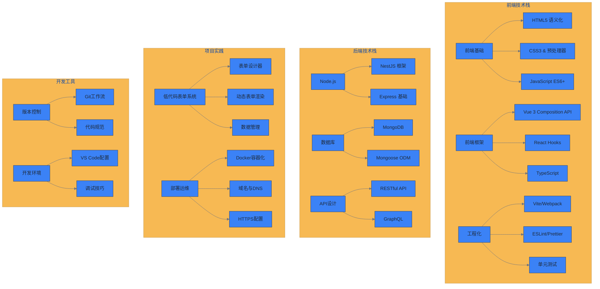
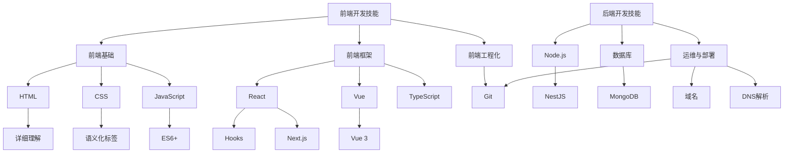

---
# https://vitepress.dev/reference/default-theme-home-page
layout: home

hero:
  name: "技术积累"
  text: "全栈开发学习笔记"
  tagline: 记录成长路径，分享技术心得
  image:
    src: /image.png
    alt: Tech Stack
  actions:
    - theme: brand
      text: 前端技术栈
      link: /frontend/
    - theme: alt
      text: 后端技术栈
      link: /backend/
    - theme: alt
      text: 项目实践
      link: /projects/

features:
  - icon: 🎨
    title: 前端技术
    details: Vue3、React、TypeScript、工程化工具等现代前端技术栈的学习与实践
    link: /frontend/
  - icon: ⚙️
    title: 后端技术
    details: NestJS、Node.js、MongoDB、RESTful API 等后端技术的深入理解
    link: /backend/
  - icon: 🚀
    title: 项目实践
    details: 低代码表单系统等完整项目的设计思路与技术实现
    link: /projects/
  - icon: 🛠️
    title: 开发工具
    details: Git、部署、运维等开发工具链的使用技巧与最佳实践
    link: /tools/
  - icon: 📚
    title: 学习资源
    details: 优质文档、教程推荐，技术书籍读书笔记
    link: /resources/
  - icon: 💡
    title: 踩坑记录
    details: 开发过程中遇到的问题及解决方案，避免重复踩坑
    link: /issues/
---

## 🗺️ 技术学习路线图

## 📋 学习计划

### 当前进行中

- [x] NestJS 框架深入学习
- [x] MongoDB 数据库设计与优化
- [x] Vue3 + TypeScript 项目实践
- [ ] 低代码表单系统完善
- [ ] 部署自动化流程

### 近期计划

- [ ] React 18 新特性学习
- [ ] GraphQL API 设计实践
- [ ] Docker 容器化部署
- [ ] 性能优化与监控
- [ ] 微前端架构探索

## 🎯 项目展示

### 低代码表单管理系统

基于 NestJS + MongoDB + Vue3 的企业级低代码平台

**技术栈：** NestJS, MongoDB, Vue3, TypeScript, Element Plus

**核心功能：**

- 🎨 可视化表单设计器
- 📊 动态表单渲染引擎
- 💾 表单数据管理
- 🔐 用户权限控制

[查看详情](/projects/form-system) | [在线演示](#) | [源码地址](https://github.com/tangjian1891/jas-table)

---

> 💡 **学习心得**：技术的学习不在于广度，而在于深度。每一个技术点都要亲自实践，记录问题与解决方案，形成自己的知识体系。

## 🔗 快速导航

### 前端技术

- [HTML5 基础](/frontend/html) - 语义化标签与现代HTML特性
- [CSS3 进阶](/frontend/css) - Flexbox、Grid、动画等现代CSS技术
- [JavaScript 核心](/frontend/javascript) - ES6+语法、异步编程、模块化
- [Vue3 实战](/frontend/vue) - Composition API、状态管理、组件设计
- [TypeScript](/frontend/typescript) - 类型系统、泛型、装饰器

### 后端技术

- [Node.js 基础](/backend/nodejs) - 事件循环、模块系统、异步编程
- [NestJS 框架](/backend/nestjs) - 依赖注入、装饰器、中间件
- [MongoDB 数据库](/backend/mongodb) - 数据建模、聚合查询、索引优化
- [API 设计](/backend/api) - RESTful设计原则、接口文档

### 项目实践

- [表单设计器](/projects/form-designer) - 可视化拖拽表单构建器
- [数据管理系统](/projects/data-management) - CRUD操作与权限控制
- [部署方案](/projects/deployment) - Docker容器化与自动化部署

### 开发工具

- [Git 工作流](/tools/git) - 分支管理、协作开发、版本发布
- [开发环境](/tools/development) - VS Code配置、调试技巧、插件推荐
- [性能优化](/tools/performance) - 代码分析、性能监控、优化策略

